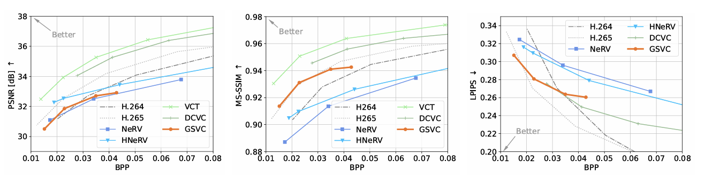

# GSVC
Official Pytorch implementation of **AN EXPLORATION WITH ENTROPY CONSTRAINED 3D
 GAUSSIANS FOR 2D VIDEO COMPRESSION**.


## Overview


 3DGaussian Splatting (3DGS) has witnessed its rapid development in novel view
 synthesis, which attains high quality reconstruction and real-time rendering. At
 the same time, there is still a gap before implicit neural representation (INR) can
 become a practical compressor due to the lack of stream decoding and real-time
 frame reconstruction on consumer-grade hardware. It remains a question whether
 the fast rendering and partial parameter decoding characteristics of 3DGS are ap
plicable to video compression. To address these challenges, we propose a Toast
like Sliding Window (TSW) orthographic projection for converting any 3D Gaus
sian model into a video representation model. This method efficiently represents
 video by leveraging temporal redundancy through a sliding window approach.
 Additionally, the converted model is inherently stream-decodable and offers a
 higher rendering frame rate compared to INR methods. Building on TSW, we
 introduce an end-to-end trainable video compression method, GSVC, which em
ploys deformable Gaussian representations and optical flow guidance to capture
 dynamic content in videos. Experimental results demonstrate that our method
 effectively transforms a 3D Gaussian model into a practical video compressor.
 GSVC further achieves better rate-distortion performance than NeRV on the UVG
 dataset, while achieving higher frame reconstruction speed (+30% fps) and stream
 decoding. 

## Performance
<p align="left">

</p>


## Installation

1. Unzip files
```
cd submodules
unzip gridencoder.zip
unzip simple-knn.zip
cd simple-knn
python setup.py install
cd ../gridencoder
python setup.py install
```

2. install other modules
```shell
pip install git+https://github.com/actcwlf/gsvc_cuda_ans.git
pip install git+https://github.com/actcwlf/ortho_diff_gaussian_rasterization.git
```

3. install tmc from [mpeg-pcc-tmc13](https://github.com/MPEGGroup/mpeg-pcc-tmc13.git)

## Data

For data preparation, please transform original video to frames. The optical flow is obtained from original pre-trained [VideoFlow](https://github.com/XiaoyuShi97/VideoFlow)

Note: Due to our limited computational resources, 
we estimated the optical flow in batches and only utilized backward optical flow during our model training.

## Training

```shell
python train_model.py \
  --source_path <dir of frames> \
  --optical_path <dir of optical flow results> \
  --tmc3_executable <path to tmc executable> \
  --model_path <output dir> \
  --config_path ./cfgs/cfg_20240906.yaml \
  --lmbda 0.004
```


## Contact

- Xiang Liu: liuxiang22@mails.tsinghua.edu.cn

## Citation

If you find our work helpful, please consider citing:

```bibtex
@inproceedings{liuexploration,
  title={An Exploration with Entropy Constrained 3D Gaussians for 2D Video Compression},
  author={Liu, Xiang and Chen, Bin and Liu, Zimo and Wang, Yaowei and Xia, Shu-Tao},
  booktitle={The Thirteenth International Conference on Learning Representations}
}
```

## LICENSE

Please follow the LICENSE of [3D-GS](https://github.com/graphdeco-inria/gaussian-splatting).

## Acknowledgement

 - We thank all authors from [3D-GS](https://github.com/graphdeco-inria/gaussian-splatting) for presenting such an excellent work.
 - We thank all authors from [Scaffold-GS](https://github.com/city-super/Scaffold-GS) for presenting such an excellent work.
 - We thank all authors from [HAC](https://github.com/YihangChen-ee/HAC) for presenting such an excellent work.
 - We thank all authors from [VideoFlow](https://github.com/XiaoyuShi97/VideoFlow) for presenting such an excellent work.